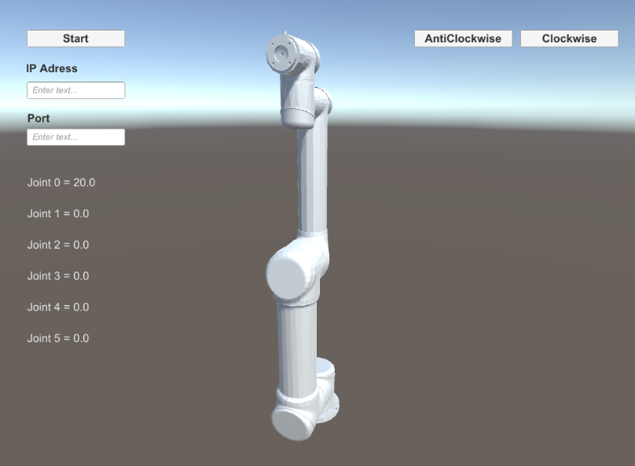
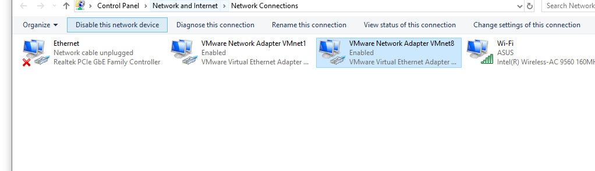
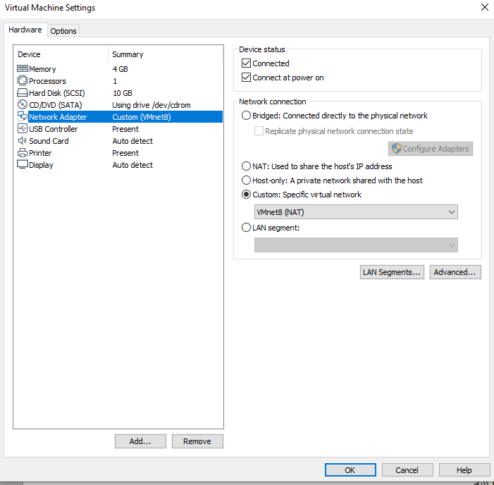
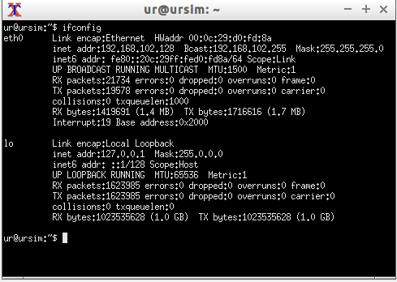
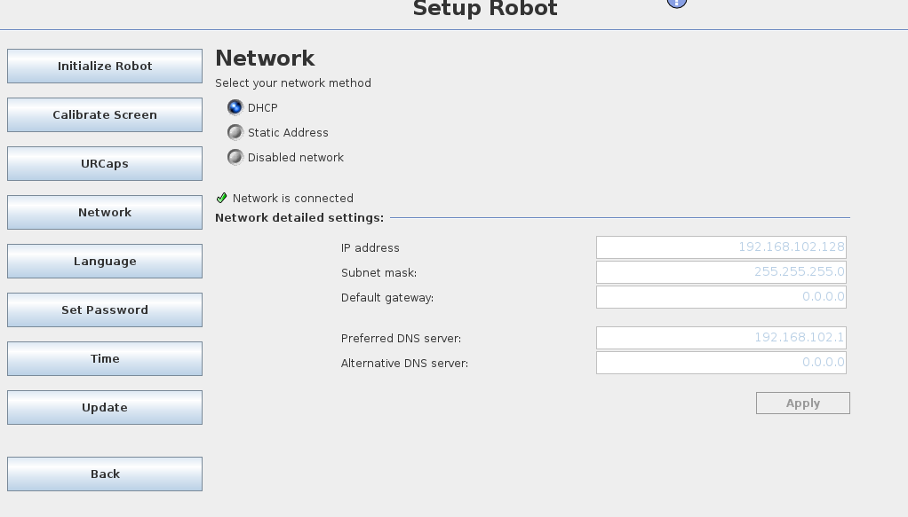
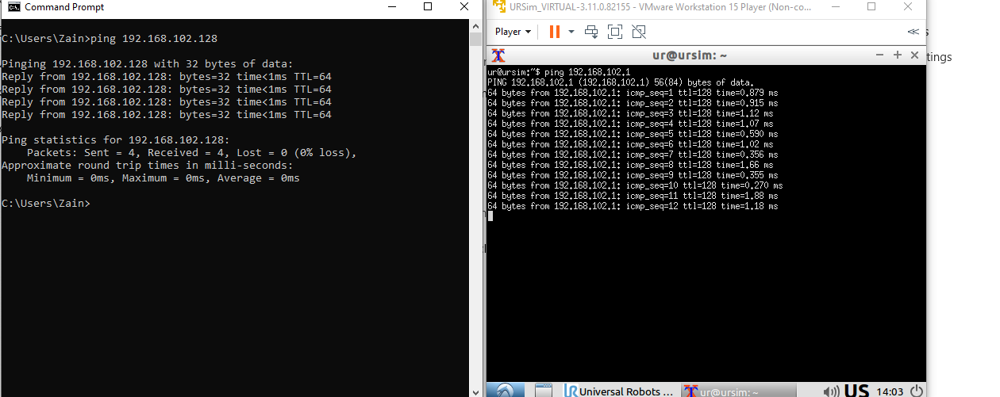

# UR-Simulation-in-Unity-Hardware-in-the-loop-Animation-of-Real-Robot-

**All the credit for original package and controller goes to [Long Qian](http://longqian.me/aboutme), [Shuyang Chen](https://www.linkedin.com/in/shuyang-shawn-chen-346ab6109) for creating the prefab and initial script.

This fork Simulates UR using joint angles being published by a real robot over TCP IP.
- Additions and Modifications are as follows:
#### - TCP server that can connect to real UR5/UR10
#### - Some modifications in the joint angle mapping to replicate actual robot. 
#### - Buttons for camera rotation.

You need to publish joint angles from UR script to this server in order to replicate motion.

Results on Editor:

## Instructions for URsim
### UR Simulator
I have used URSIM version 3.11 which can be downloaded from https://www.universal-robots.com/download/?option=18940.

### VMware
Download vmware from https://www.vmware.com/products/workstation-pro/workstation-pro-evaluation.html. I think any version not so obsolete should work. Once you have installed vmware you should have two VMware Network Adapters named VMnet1 and VMnet8 in Windows network Connections.

### Setup
- First you need to configure network settings in vmware. Go to Player->Manage-> Virtual Machine Settings. In "Device" panel choose 
  "Network Adapter". In my case I choose VMnet8(NAT). 
  
- Open network adapter's properties in Windows and set static ip address as follows:
  Check ipv4 address of guest in vmware using ifconfig. 
  
  In my case it was "192.168.102.128". I set ip of VMnet8 as "192.168.102.1" with same subnet mask. This will be the IP of your server.
- Open URsim10/URsim5 and check robots network setting in "Setup Robot" -> Network. Choose DHCP. It will assign the same ip address to   
  the robot as that of guest (192.168.102.128) in my case.
  
- Disable firewall in windows otherwise guest wont be able to communicate with the host. 
- If everything goes well you should be able to ping back and firth between guest and the host.
  
